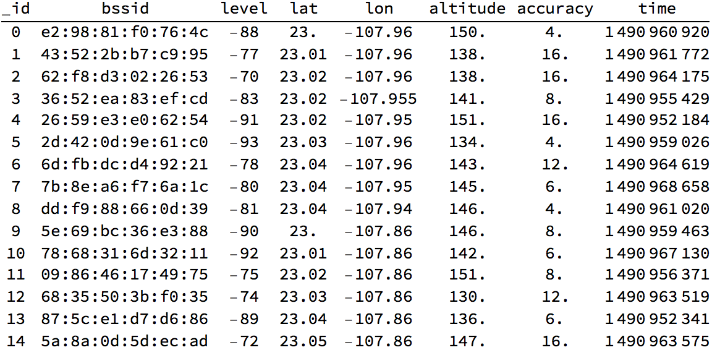

# picoCTF 2017 – Connect The Wigle

## Problem

Identify the data contained within wigle and determine how to visualize it. Update 16:26 EST 1 Apr If you feel that you are close, make a private piazza post with what you have, and an admin will help out.

### Hints

   + Perhaps they've been storing data in a database. How do we access the information?
   + How can we visualize this data? Maybe we just need to take a step back to get the big picture?
   + Try zero in the first word of the flag, if you think it's an O.
   + If you think you're super close, make a private piazza post with what you think it is.

## Solution

The `wigle` file is a SQLite database. Mathematica can load a SQLite database directly using JDBC.

```mathematica
Needs["DatabaseLink`"]
db = OpenSQLConnection[
    JDBC["SQLite", FileNameJoin[{NotebookDirectory[], "wigle"}]]];
```

Preview the data. We will be using the `lon` and `lat` columns.

```mathematica
Grid[SQLExecute[db, "SELECT * FROM location LIMIT 15", 
    "ShowColumnHeadings" -> True], Dividers -> {False, {False, True}}]
```



Just plot the `lon` and `lat` columns as points.

```mathematica
Graphics@Point@SQLExecute[db, "SELECT lon, lat FROM location"]
```


The flag is easily readable. The flag is: `FLAG{F0UND_M3_3C32EF91}`

