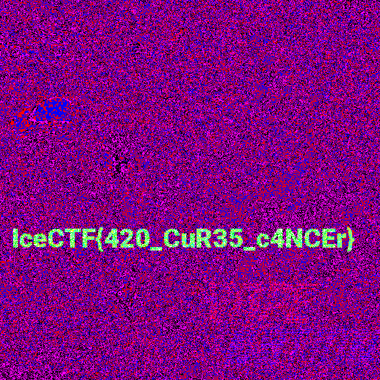

# IceCTF 2016 – Vape Nation

## Problem

>Go Green!

## Solution

Mathematica can download the image with `Import[]`.

```mathematica
image = Import["https://play.icec.tf/problem-static/vape_nation_7d550b3069428e39775f31e7299cd354c721459043cf1a077bb388f4f531d459.png"]
```


But this problem likely involves steganalysis of the pixel data of the image. We can specify `"Data"` in the `Import[]` call to download the image. Or we can convert the image data to byte data after downloading with ImageData[].

```mathematica
imageData = Import[
  "https://play.icec.tf/problem-static/vape_nation_7d550b3069428e39775f31e7299cd354c721459043cf1a077bb388f4f531d459.png",
  "Data"];
```

Let's try previewing the least significant bit (LSB) of each channel of the image.

First we extract the LSB of each channel by calling `BitAnd[]` with `1`. Then reconstruct an `Image[]` and `ImageAdjust[]` the image to make the minute differences of each pixel visible.

```mathematica
flagImage = ImageAdjust@Image[BitAnd[imageData, 1], "Byte"]
```



The flag is easily readable. The flag is green in the image because it is in the green channel. The green channel is the second channel of the image and can be extracted with `ColorSeparate[]` if desired.

Additionally, we can attempt to extract the text from the image by OCR using `TextRecognize[]` for easy copy pasting to submit the flag.

```mathematica
TextRecognize@ColorSeparate[flagImage][[2]]
```

```
IceCTF{420_CuR35_c4NCEr}
```


