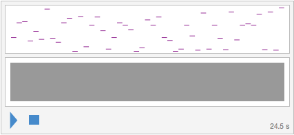
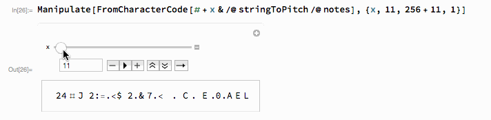

# IceCTF 2016 – Blue Monday

## Problem

> Those who came before me lived through their vocations From the past until completion, they'll turn away no more And still I find it so hard to say what I need to say But I'm quite sure that you'll tell me just how I should feel today.

## Solution

Import the MIDI file into a `Sound[]` instance.


```mathematica
midi = Import[
  "https://play.icec.tf/problem-static/blue_monday_ff0973317ee7c2df4225f994ad49bb4075546b9f20eb22bbc636be910f628bfd"]
```



Extract the notes from the `SoundNote[]` instances inside the `Sound[]`.


```mathematica
notes = midi[[1, All, 1]]
```

```
{C#5, D#7, F7, G4, C6, A#4, D#9, C5, F4, D#7, B7, C#3, D8, A3, B6, C#8, C#6,
F3, C#5, D#7, B6, D#6, C#3, G3, G#7, B6, C#8, C#5, G#4, C#3, F3, B6, E5, D#3,
G#8, F3, B6, C5, E3, A#8, A4, B6, C#7, B6, F#8, E3, A#8, D#3, F9}
```

Mathematica cannot convert notes to pitches directly. Use some code from the Mathematica StackExchange instead: [http://mathematica.stackexchange.com/a/42944/13764](http://mathematica.stackexchange.com/a/42944/13764)


```mathematica
(*Converts note string into pitch relative to middle C=0*)
stringToPitch[string_String] := 
 Module[{noteValues, noteList, pitch}, 
  noteValues = {"C", "C#", "D", "D#", "E", "F", "F#", "G", "G#", "A", 
    "A#", "B"};
  noteList = StringCases[
   string, {RegularExpression["[A-G]#?"], RegularExpression["\\d+"]}];
  pitch = Position[noteValues, First[noteList]][[1, 1]] - 1;
  ((ToExpression[noteList[[2]]] - 4)*12) + pitch]
```


```mathematica
stringToPitch /@ notes
```

```
{13, 39, 41, 7, 24, 10, 63, 12, 5, 39, 47, -11, 50, -3, 35, 49, 25,
-7, 13, 39, 35, 27, -11, -5, 44, 35, 49, 13, 8, -11, -7, 35, 16, -9,
56, -7, 35, 12, -8, 58, 9, 35, 37, 35, 54, -8, 58, -9, 65}
```

Guess the offset for the characters. Use a `Manipulate[]` to easily try different offsets and preview the decoding. It should look like something alphanumeric if our guess is close.


```mathematica
Manipulate[
 FromCharacterCode[stringToPitch /@ notes + x], {x, 11, 256 + 11, 1}]
```



Of course... the format is IceCTF{...}, so the first character will be "I".


```mathematica
FromCharacterCode[
 stringToPitch /@ notes + ToCharacterCode["I"][[1]] - stringToPitch[First@notes]]
```

```
IceCTF{HAck1n9_mU5Ic_W17h_mID15_L3t5_H4vE_a_r4v3}
```
