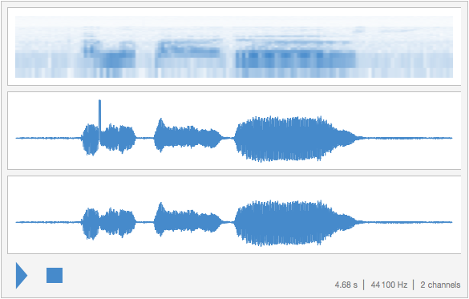
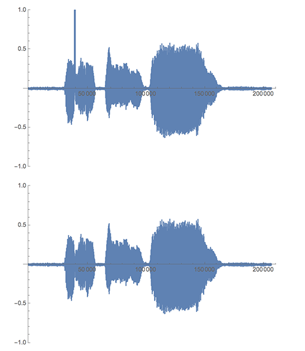
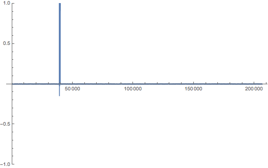
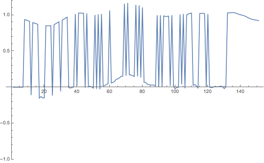
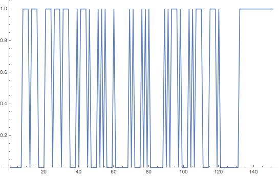
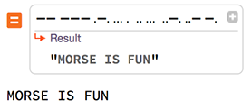

# TUCTF 2016 – Beatz for Dayz

## Problem

Flag hidden in a FLAC file.

## Solution

Download the FLAC file into a `SampledSoundList[]` instance. This sound primitive contains samples that represent the amplitude and it is easy to work with.

```mathematica
sampledSoundList = Import[
  "http://ctf.asciioverflow.com/static/uploads/63811a1fd9fc936477585d0c67415fb0/2108dd8652498e179096eecf746ea8301c3cbe0b.flac",
  "SampledSoundList"];
```

We can easily view the waveform easily with `Sound[]`. Notice there is a strange bump in one channel of the waveform. We will isolate it and see what it looks like.

```mathematica
Sound[sampledSoundList]
```



Next, extract the left and right channels of the audio. Mathematica's destructuring can be used to unpack the list.

```mathematica
{left, right} = First@sampledSoundList;
```

We can plot the waveforms manually too.

```mathematica
GraphicsColumn[ListLinePlot[#, PlotRange -> {-1, 1}] & /@ {left, right}]
```



Take difference of the channels by simply subtracting one list (channel) from the other. Examine the result by plotting it.

```mathematica
ListLinePlot[left - right, PlotRange -> {-1, 1}]
```



Examine the interesting portion of the waveform by graphing a portion of the list.

```mathematica
ListLinePlot[(left - right)[[39150 ;; 39300]], PlotRange -> {-1, 1.2}]
```



Isolate the interesting portion of the signal by taking the `Threshold[]` of it at 0.5 and stretching the rest of signal to the minimum and maximum range with `Unitize[]`. This will produce a list of only 1's and 0's.

```mathematica
diff = Unitize@Threshold[left - right, {"Hard", 0.5}];
```

Graph the new list.

```mathematica
ListLinePlot[diff[[39150 ;; 39300]]]
```



`Split[]` the waveform into a list of segments where the value is the same (1 or 0). Then replace each sublist with the value repeated in the list and the length of the run of values.

```mathematica
{First[#], Length[#]} & /@ Split@diff
```

```
{{0, 39156}, {1, 4}, {0, 1}, {1, 4}, {0, 4}, {1, 4}, {0, 1}, {1, 4},
{0, 1}, {1, 4}, {0, 4}, {1, 1}, {0, 1}, {1, 4}, {0, 1}, {1, 1}, {0, 4},
{1, 1}, {0, 1}, {1, 1}, {0, 1}, {1, 1}, {0, 4}, {1, 1}, {0, 8}, {1, 1},
{0, 1}, {1, 1}, {0, 4}, {1, 1}, {0, 1}, {1, 1}, {0, 1}, {1, 1}, {0, 8},
{1, 1}, {0, 1}, {1, 1}, {0, 1}, {1, 4}, {0, 1}, {1, 1}, {0, 4}, {1, 1},
{0, 1}, {1, 1}, {0, 1}, {1, 4}, {0, 4}, {1, 4}, {0, 1}, {1, 1}, {0, 11},
{1, 580}, {0, 166708}}
```

Convert each value and run to a character representation of its Morse value.

```mathematica
StringJoin[({First[#], Length[#]} & /@ Split@diff)[[2 ;; -4]] /. {
   {1, 4} -> "-",
   {1, 1} -> ".",
   {0, 1} -> "",
   {0, 4} -> " ",
   {0, 8} -> "  "}]
```

```
-- --- .-. ... .  .. ...  ..-. ..- -.
```

Mathematica cannot decode Morse Code directly, so use WolframAlpha instead.


