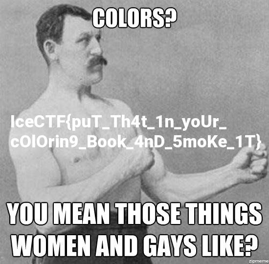

# IceCTF 2016 – Pretty Pixels

## Problem

>Don't get me wrong, I love pretty colors as much as the next guy... but what does it mean?

## Solution

If we preview the image, it is just pure multicolored noise.

```mathematica
image = Import["https://play.icec.tf/problem-static/pretty_pixels_604e889db44de75ea4541a23e344b80eb315f0faf4136abc6d40e1fff8802c9f.png"]
```


We want the values for each pixel. We could use `ImageData[image,"byte"]`, or we can specify `"Data"` when downloading the image to get the byte data of each pixel.

```mathematica
imageData =
  Import[
   "https://play.icec.tf/problem-static/pretty_pixels_604e889db44de75ea4541a23e344b80eb315f0faf4136abc6d40e1fff8802c9f.png",
   "Data"];
```

Lets try to interpret the first 100 pixels (300 RGB values) of the image as ASCII bytes.


```mathematica
FromCharacterCode[Flatten[imageData][[;; 300]]]
```

```
‰PNG


IHDR&	s(bKGDÿÿÿ ½§“	pHYsšœtIMEà"Wÿ0fEiTXtCommentCREATOR: gd-jpeg v1.0 (using IJG JPEG v62), quality = 80
f_-w IDATxÚ̽yåuy5~ºûÞ¾{ßÞféٜÑP,3F˘ Á*“X‰I¦"˜(¸U¢’|Q4j¢&Æ1hX¢„ˆBXY‘mgÆ٘ž^nßýö½}û/‡ïùüÎ}æùÜnß¼oÅ®š‚™¾Ë/ûù~–óœ
```

That looks like the PNG header. Let's interpret pixel of the image as bytes and convert it into a string of binary data. Then use `ImportString[]` to import the data as if it were a file of binary data.

```mathematica
ImportString@FromCharacterCode@Flatten@imageData
```


