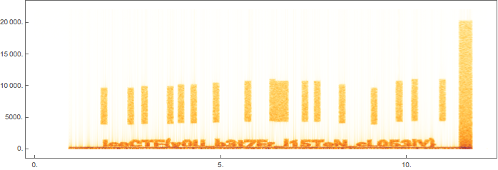

# IceCTF 2016 – Audio Problems

## Problem

>We intercepted this audio signal, it sounds like there could be something hidden in it. Can you take a look and see if you can find anything?

## Solution


```mathematica
sound = Import["https://play.icec.tf/problem-static/audio_problems_210b88f2232e1c9d770bb5d2069c47aabb86301b0adc7ad606956394a00f298b.wav"]
```

The flag is immediately visible in the spectrogram.

```mathematica
Spectrogram[sound]
```



If desired, we could create an image of that portion of the spectrogram.

```mathematica
arr = Transpose@Abs@SpectrogramArray[sound, 3000, 100, BartlettWindow];
img = ImageResize[ColorNegate@Image[arr[[2900 ;; 2983, ;; 5000]]], {1000, 100}]
```


